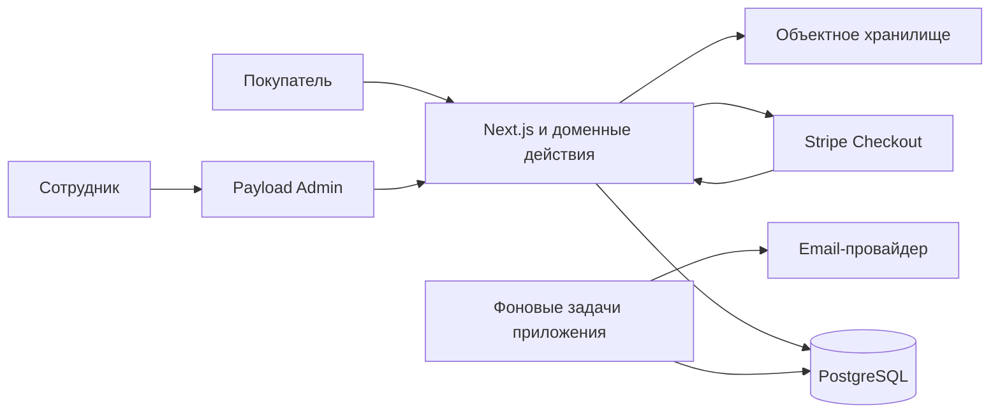

# Архитектура

Согласованная основа; детали — техническое предложение, код отсутствует.
[Design](../openspec/changes/define-bike-store-mvp/design.md) и [вопросы](ai/OPEN-QUESTIONS.md).

Один модульный монолит Next.js/Payload и отдельный процесс фоновых задач того же приложения.
Одна PostgreSQL и объектное хранилище. CMS — контент и оболочка админки;
финансовые операции и резервы выполняют доменные действия.

Модули каталога, остатков, заказов, аккаунтов, платежей, исполнения/возвратов,
контента/уведомлений — границы ответственности внутри приложения, не сервисы.
Схема: ProductModel → SKU; InventoryBalance(SKU, StockLocation); Reservation/ReservationLine;
Order/OrderLineItem; PaymentAttempt; Shipment/Collection; ProductReturn/ReturnLine; Refund.
Заказы хранят снимки цен/VAT/товара/адреса. Деньги — целые пенсы; VAT Snapshot и
точный алгоритм расчёта/возврата — design DD-01. SKU имеют независимые Tax Category
и Shipping Class; Shipping Tariff не вычисляет упаковку. Состояния Order, Payment
и Fulfilment раздельны, завершение не стирается refund.

Горизонтальный рост: stateless web, общая БД/сессии/хранилище, блокировки при получении задач.
10 тысяч SKU проверяются нагрузкой и репрезентативными данными, не обещаются схемой.
Managed hosting предложен в design DD-04/PROVIDERS: DigitalOcean London web+worker,
PostgreSQL Standard/PITR, Spaces/CDN и независимые копии. Это design decision в бюджете
£75–150, а не подключённая инфраструктура; RPO ≤ 5 min/RTO ≤ 4h предстоит проверить.
