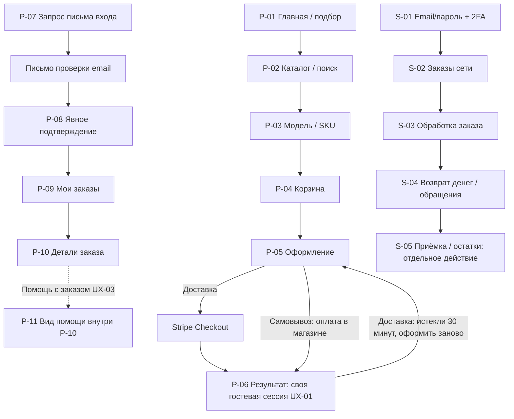

# Пользовательские сценарии и структура экранов

Обновлено 9 октября 2026 года после согласования владельцем продукта.
Статус: J-01–J-12, структура P-01–P-13/S-01–S-10, карта переходов и её уточнения согласованы
с дополнениями к J-10, J-11 и P-01 ниже. Бизнес-ответы UX-01–UX-13 внесены.
Точные макеты и оставшиеся технические детали ещё не согласованы. Реализация — 0/69 задач.
**9 октября владелец отдельной командой разрешил работу над прототипом согласованной части.**
Прототип создан и независимо проверен; [руководство](prototype.md).
Этап макета описан в [prototype-bike-store](../openspec/changes/archive/2026-10-09-prototype-bike-store/proposal.md);
production-реализация остаётся 0/69, открытые UX-параметры не утверждаются макетом.

## Как читать согласованный документ

Это понятное изложение OpenSpec с ответами владельца от 8–9 октября и согласованной структурой экранов.
Нормативный источник — [define-bike-store-mvp](../openspec/changes/define-bike-store-mvp/proposal.md)
и его specs. Этот документ не заменяет требования и не добавляет бизнес-правил.
Параметры безопасного входа и другие технические решения взяты из [design](../openspec/changes/define-bike-store-mvp/design.md).
Термины соответствуют [словарю](THESAURUS.md): модель товара объединяет варианты SKU;
заказ, оплата, получение товара и денежный возврат — разные понятия.

Различайте три вида сведений:

- **Из OpenSpec** — уже описанное поведение; ссылки и ID указывают источник.
- **Согласованная структура интерфейса** — названия, группировка и связи экранов; точные макеты ещё предстоят.
  Например, размещение отмены в карточке заказа не определяет новые права на отмену.
- **Уточнение UX-…** — ссылка на [ответы владельца и оставшиеся детали](ai/UX-OPEN-QUESTIONS.md).
  Бизнес-ответы зафиксированы, параметры/компоновка остаются предложениями.
  Исправление UX-02 согласовано владельцем; точные механизмы и компоновка ещё предлагаются.

Владелец согласовал пути J-01–J-12, структуру экранов и карту переходов 9 октября.
Уточнения этого сообщения отражены ниже и в OpenSpec. Согласование структуры не закрывает
нерешённые технические детали. После отдельной команды владельца разрешён интерактивный
макет согласованной части; production-реализация не входит в этот этап.

## Кто пользуется системой

| Участник | Что уже разрешено требованиями |
|---|---|
| Гость | Подбирать товары и оформлять заказ без предварительной регистрации. Указание email само по себе не открывает аккаунт или историю. |
| Покупатель после проверки email | Видеть собственные заказы и их состояния; чужие заказы недоступны. |
| Менеджер (Manager) | Обрабатывать заказы всей сети, управлять остатками, редактировать/публиковать блог и информационные страницы, управлять товарными подборками главной; без глобальных настроек, управления правами и редактирования ассортимента/цен. |
| Администратор сети (Network Administrator) | Управлять ассортиментом, магазинами, заказами, сотрудниками, правами и контентом. |

Основание: ACC-01–ACC-03, ADM-01–ADM-03. Менеджер не ограничен только своим магазином.
Вход сотрудников: email/пароль и обязательная 2FA, доступ выдаёт владелец (UX-05).
Тип второго фактора и восстановление его утраты ещё не выбраны.

## Сквозные пути

### J-01. Найти велосипед или другой товар

**Цель:** выбрать конкретный продаваемый вариант, понимая цену и наличие.
**Вход:** главная страница, каталог или поиск. **Экраны:** P-01 → P-02 → P-03 → P-04.
**Источник:** [catalog](../openspec/changes/define-bike-store-mvp/specs/catalog/spec.md), CAT-01–CAT-05;
[inventory](../openspec/changes/define-bike-store-mvp/specs/inventory/spec.md), INV-02–INV-03.

1. На главной покупатель задаёт параметры подбора велосипеда: цену, тип, рост, колёса, бренд.
   До перехода видит число подходящих моделей, а не число SKU. Либо начинает с каталога/поиска.
   Первый экран может привлекать сдержанной подборкой новых, интересных или уценённых товаров.
   Её состав меняют менеджер и администратор; точный вид карточек/слайдера определяется в прототипе.
   На desktop подбор не занимает неоправданно большую высоту; на mobile дополнительное место
   допустимо, когда улучшает читаемость и удобство. Избыток баннеров и подборок исключается.
2. В результатах уточняет категорийные фильтры и сортировку. Все условия одновременно
   должны выполняться одним SKU модели; наличие зависит от склада или выбранного магазина.
3. Открывает карточку модели, изучает фото, описание и характеристики, выбирает SKU.
   Цена, фото и наличие отражают выбранный вариант. Цены — GBP с VAT; снижение показано отдельно.
4. Добавляет вариант в корзину. **Добавление ещё не резервирует товар.**

**Ответвления:** нет результатов → изменить параметры; несколько подходящих размеров →
показать варианты; нет таблицы ростовки → сообщить об отсутствии данных, не угадывать размер.
Наличие в сети не обещает доставку со склада или самовывоз из конкретного магазина.
**Ответ UX-04:** место получения выбирается в начале покупки и меняется в процессе;
наличие/цены обновляются, недоступные товары остаются с предупреждением. Расположение выбора
предложим в прототипе. Уже оформленный заказ этим переключением не изменяется (UX-08).
Отдельно согласовано: в карточке явно показано сохранённое получение заказа, выбор
витрины обозначен для следующей покупки. Граница — создание заказа, независимо от оплаты.

### J-02. Купить с доставкой: обычный успешный путь

**Цель:** оформить, оплатить и получить весь заказ со склада.
**Вход:** корзина с выбранными SKU. **Экраны:** P-04 → P-05 → внешняя форма Stripe → P-06;
после проверки email — P-09 → P-10. Работа сотрудника — J-08.
**Источник:** [checkout](../openspec/changes/define-bike-store-mvp/specs/checkout/spec.md), CHK-01–CHK-04;
[payments](../openspec/changes/define-bike-store-mvp/specs/payments/spec.md), PAY-01;
[inventory](../openspec/changes/define-bike-store-mvp/specs/inventory/spec.md), INV-02–INV-04;
[fulfilment](../openspec/changes/define-bike-store-mvp/specs/fulfilment/spec.md), FUL-01–FUL-03;
ACC-01–ACC-03, CNT-02.

1. Покупатель проверяет корзину, меняет количество или удаляет позиции. Корзина сохраняется
   при переходах и обновлении страницы; отрицательное/дробное количество отклоняется.
2. Вводит имя, email, телефон, выбирает доставку и указывает адрес. Предварительный вход не требуется.
3. До согласия на оплату видит серверный итог: товары и доставку. Проверяются цены, адрес,
   тариф и доступность **всей корзины на центральном складе**. Изменившаяся цена показана заранее.
4. Начинает оплату: все позиции резервируются атомарно на 30 минут с начала оплаты;
   используется внешняя карточная форма. Сайт не хранит карточные данные.
5. Возвращается на сайт. Пока сервер не подтвердил платёж и обеспечение всей корзины,
   интерфейс не объявляет заказ оплаченным/confirmed только по возврату со Stripe.
6. После подтверждения заказ становится confirmed. Позиции оплаченного заказа больше
   не освобождаются по 30-минутному сроку. Покупатель получает соответствующее письмо.
7. Сотрудник регистрирует отправку и позднее достоверное подтверждение доставки.
   Покупатель видит предоставленные сведения; после delivered заказ становится completed.

**Ответвления:** ошибка поля → указать поле; недоступный адрес → предложить другой адрес;
нет проверенного тарифа → изменить адрес/способ получения, не придумывать сумму;
не хватает одной позиции → не создавать частичный резерв. Оплата не удалась → J-03.
По UX-01 действующая гостевая сессия исходного браузера разрешает текущий заказ,
повтор оплаты в резерве и допустимую отмену; другое устройство/утрата сессии требуют email proof.
Механизм сессии и объём показанных данных ещё предложим.
Предложение P-05 как одной страницы не определяет число шагов будущего прототипа (UX-09).

### J-03. Ошибка оплаты, повтор и поздний платёж

**Цель:** понять судьбу заказа и денег после неуспешной или задержанной оплаты.
**Экраны:** P-06/P-10 → Stripe → P-06/P-10; при ошибке возврата сотрудник использует S-04.
**Источник:** PAY-01–PAY-03, INV-03–INV-04, ACC-03, CNT-02; design «Stripe и срок».

1. После отказа банка заказ и история попыток сохраняются. Пока исходный резерв действует,
   покупатель может повторить оплату. Повтор не начинает новые 30 минут.
2. Когда неоплаченный резерв истёк, позиции освобождаются, заказ остаётся в истории.
   По согласованному UX-02 вместо оплаты — «Оформить заново»: SKU и количества переносятся
   в новое оформление с повторной проверкой цены/наличия/условий. При начале переоформления
   старый заказ явно отменяется и сохраняется; созданный новый связан со старым. Старый резерв
   не продлевается. Повтор действия не создаёт несколько новых заказов.
3. Если успешный платёж пришёл после обычного истечения, система повторно проверяет всю корзину:
   при доступности всех позиций принимает заказ; иначе инициирует полный денежный возврат и уведомляет.
4. Если заказ уже явно отменён, поздний платёж его не восстанавливает: возвращается весь полученный платёж,
   включая доставку. До подтверждения возврата нельзя писать «деньги возвращены».
5. При pending/failed обязательство сохраняется, сотрудник видит проблему и обрабатывает её.
   Повтор одного события не создаёт второй платёж/возврат.

**Важно для экрана:** отдельно показывать состояние заказа, платежа и денежного возврата.
Письмо «заявка получена» при pending не означает «заказ подтверждён». Проверка email — J-05,
а не доказательство оплаты. Гостевой повтор разрешён в исходной действующей сессии по UX-01, без доступа к общей истории.
При переоформлении и одновременном платеже: отмена принята первой → полный возврат старого платежа;
оплата принята первой → предусмотренный запрос отмены, без автоматического двойного исполнения.

### J-04. Заказать самовывоз и получить товар

**Цель:** забрать всю корзину в одном магазине с оплатой на месте.
**Экраны:** P-04 → P-05 → P-06; после проверки email — P-10. Сотрудник: S-02 → S-03.
**Источник:** INV-02–INV-03, INV-05, CHK-01–CHK-04, PAY-04, FUL-02, CNT-02.

1. Покупатель выбирает один магазин с наличием всех позиций. Если товары есть только в разных
   магазинах, самовывоз этой корзины из одной точки недоступен. Межмагазинных перемещений нет.
2. Оформляет заказ с контактами: вся корзина сразу атомарно резервируется, заказ confirmed,
   оплата ещё unpaid. Онлайн-оплаты самовывоза нет.
3. Магазин должен подготовить заказ не позднее следующего своего рабочего дня.
   Менеджер отмечает фактическую готовность; покупатель получает письмо со сроком получения.
4. После готовности направляется специальный код получения (UX-06). Срок заканчивается в конце третьего календарного дня после даты готовности, Europe/London:
   готовность в понедельник → получить можно до конца четверга.
5. Менеджер может один раз **до истечения** продлить срок максимум на 3 календарных дня
   от исходного конца срока. Новый срок сообщается покупателю; автор и время сохраняются.
6. Получатель предъявляет специальный код: покупатель может передать его другому человеку.
   Менеджер проверяет код, фиксирует полную оплату, её сумму и способ, затем подтверждает выдачу
   подготовленного заказа. Одного номера заказа недостаточно; формат/проверки кода ещё предложим. Исполнение collected, заказ completed. Запись оплаты сама по себе не означает выдачу.

**Ответвления:** задержка подготовки видна менеджеру и не сокращает срок покупателя;
повторная отметка готовности не сдвигает срок; после истечения неоплаченного и невыданного
самовывоза заказ отменяется, резерв освобождается, покупатель уведомляется.
Выдача и истечение не могут одновременно завершиться успешно.
**Ответы:** просьба продлить подаётся через «Помощь с заказом» либо email поддержки (UX-03);
выдача — по специальному коду (UX-06). Просьба не продлевает срок автоматически.
Код получения не открывает аккаунт; конкретные поля и технические параметры ещё предложим.

### J-05. Подтвердить email, войти и увидеть свои заказы

**Цель:** безопасно получить доступ к собственному заказу и истории.
**Экраны:** P-07 → письмо → P-08 → P-09 → P-10.
**Источник:** [customer-accounts](../openspec/changes/define-bike-store-mvp/specs/customer-accounts/spec.md),
ACC-01–ACC-03; design DD-03; CAT-06.

1. При гостевом оформлении с новым email создаётся аккаунт без активного доступа.
   Ввод существующего email не раскрывает профиль, адреса или историю.
2. Покупатель получает одноразовую ссылку для конкретного гостевого заказа либо ссылку входа
   в историю с отдельным назначением. Вход без предшествующего заказа не специфицирован отдельно.
3. Открывает экран подтверждения и явно подтверждает действие. Простое открытие ссылки
   не должно расходовать её. Если открыта чужая клиентская сессия, требуется явная смена аккаунта.
4. После действительного подтверждения получает доступ; конкретный гостевой заказ связывается
   с существующим аккаунтом без дубликата и перезаписи профиля гостевыми данными.
5. Видит свои заказы, включая неоплаченные/отменённые, снимки купленных товаров и раздельные состояния.
   Удаление товара из каталога не удаляет его из истории заказа.

**Ответвления:** просроченная/использованная ссылка → доступа нет, предусмотрена повторная отправка
с ограничениями из DD-03; отсутствие письма → экран повторной отправки; сбой email не меняет заказ.
Истечение ссылки не отменяет заказ и не продлевает резерв. После выхода доступ отзывается.
По UX-07 ошибочный email исправляет сотрудник поддержки после проверки принадлежности заказа;
последующие уведомления идут на новый адрес. Самостоятельной смены без проверки нет.
Процедура проверки/отзыва старого доступа и перепривязки аккаунта ещё предложена не была. Произвольная регистрация, пароли, социальный вход
и редактор адресной книги не включены в согласованную структуру.

### J-06. Отказаться от заказа или запросить отмену

**Цель:** остановить заказ в предусмотренной ситуации и видеть истинный результат.
**Экраны:** P-10, P-06 с действующей гостевой сессией до проверки email (UX-01); сотрудник — S-03/S-04.
**Источник:** [returns](../openspec/changes/define-bike-store-mvp/specs/returns/spec.md), RET-01;
INV-04, PAY-03, FUL-02; design «Stripe и срок».

1. До оплаты покупатель отказывается: заказ отменяется, резерв освобождается, история сохраняется.
2. После оплаты и до отправки покупатель подаёт запрос отмены; менеджер или администратор его обрабатывает.
   **Запрос не равен принятой отмене и не доказывает возврат денег.**
3. При принятой отмене до завершения заказ cancelled; денежный возврат учитывается отдельно.
   Поздний платёж не возобновляет отменённый заказ.
4. После отправки/получения применимые обращения идут по пути возврата J-07.
   Возврат по completed-заказу не превращает историю получения в cancelled.

**Ответвления:** одновременные оплата/отмена обрабатываются согласованно сервером,
интерфейс отражает фактический результат. Если платёж обработан первым, применяется предусмотренный
запрос отмены; исполнение блокируется до его разрешения (design).
По UX-08 состав/количества/адрес/магазин созданного заказа не меняются.
Если требуется изменение — допустимая отмена и новый заказ; иначе поддержка.

### J-07. Вернуть весь товар или часть и получить денежный возврат

**Цель:** подать обращение, получить инструкции и отслеживать обработку товаров и денег.
**Экраны:** «Помощь с заказом» в P-10, P-11 как вид этого раздела; сотрудник — S-04 и S-05.
**Источник:** RET-02–RET-06, PAY-04, FUL-02; design «Возвраты: сроки и обязанности».

1. Покупатель открывает «Помощь с заказом» в карточке через аккаунт, действующую гостевую
   сессию либо одноразовую ссылку после email proof; email поддержки — дополнительный канал.
   Обращение относится к позициям/количествам; причины — желание, брак, ошибочный товар.
   Поля и форма обработки ещё предложим. Без тикетной системы, чата и обязательной регистрации (UX-03).
2. Сотрудник устанавливает право и сумму. Возвращаемое количество ограничено приобретённым
   за вычетом возвращённого; расчёт использует фактическую оплаченную цену и снимок заказа.
3. Обратную доставку при браке/ошибке оплачивает бизнес. При обычном возврате — покупатель
   при надлежащем предварительном информировании и отсутствии иной обязанности бизнеса.
   Отсутствие информации не позволяет автоматически переложить расходы на покупателя.
4. После установления права и суммы денежный запрос направляется без намеренного пакетного ожидания.
   Покупатель видит pending/succeeded/failed; банковское зачисление не обещается к выдуманной дате.
   Для оплаты в магазине сотрудник регистрирует фактический возврат соответствующим способом.
5. При физической приёмке сотрудник отдельно решает, пригоден ли товар для продажи.
   До решения он не увеличивает доступность; пригодный товар возвращается в остаток ровно один раз.

**Важные развилки:** при применимом полном дистанционном отказе возвращается также исходная
доставка в предусмотренном RET-05 размере; обычный частичный возврат исправного товара
не включает исходную доставку, если обстоятельства не требуют иного. Скидка не отменяет права.
Проверка пригодности для продажи не подменяет решение о праве на деньги.
Один безусловный порядок «сначала принять и проверить, затем вернуть деньги» не утверждён:
применимые условия уже описаны в design, проверка restock не задерживает причитающийся возврат.
Представление инструкций передачи товара/подтверждения отправки предложим в разделе помощи (UX-03).

### J-08. Сотрудник исполняет доставку

**Цель:** обработать оплаченный обеспеченный заказ и зарегистрировать реальные факты исполнения.
**Экраны:** S-01 → S-02 → S-03. **Источник:** FUL-02–FUL-03, ADM-02–ADM-03, CNT-02.

1. Авторизованный сотрудник открывает заказы сети и заказ доставки; видит оплату, состав и обеспечение.
2. Вручную указывает транспортную компанию, дату отправки и трек-номер при его наличии (UX-10).
   Покупатель видит состояние dispatched и сведения; API перевозчика для MVP не требуется.
3. Получив достоверное подтверждение ТК, сотрудник фиксирует доставку, основание и время.
   Исполнение delivered, действующий заказ completed; отправка сама по себе не означает доставку.
4. Если физически доставлена посылка уже отменённого заказа, факт сохраняется,
   cancelled не восстанавливается; дальнейшее обращение обрабатывается через возврат.

**Ответы:** вход email/пароль + 2FA (UX-05), компания/дата/необязательный трек-номер (UX-10).
Сроки ориентировочные по условиям доставки; при потере/повреждении/недоставке — помощь,
выяснение магазином с ТК и решение по условиям продажи/закону (UX-11). Конкретные сроки,
компенсации, метод 2FA и формат основания delivered не назначены автоматически.

### J-09. Сотрудник проводит физическую продажу или корректировку остатка

**Цель:** поддерживать достоверное наличие в системе при работе магазина.
**Экраны:** S-01 → S-05. **Источник:** INV-01, INV-03, ADM-02–ADM-03;
design «Предложение данных и операций».

1. Менеджер/администратор выбирает точку, SKU и авторизованную операцию продажи/корректировки.
2. Сервер проверяет полномочия и доступность с учётом резервов. Нельзя молча нарушить обеспечение
   уже созданных заказов; конфликт корректировки с резервами требует явного разрешения.
3. После успешной продажи меняется остаток выбранной точки, другие точки не затронуты.
   Для корректировки сохраняются сотрудник, точка, SKU, изменение и время.

**Ответ UX-12:** сотрудник сообщает менеджеру; тот проверяет исполнение из другого доступного
остатка в той же точке по INV-02. Если невозможно — связывается с покупателем для согласования
решения, включая отмену/refund. Межмагазинные перемещения и изменение точки заказа не добавлены.
Основания корректировок и форму уведомления ещё предложим.
POS/ERP, кассовое обслуживание и межмагазинные перемещения в этот путь не добавлены.

### J-10. Администратор подготавливает ассортимент и настройки сети

**Цель:** публиковать достоверные карточки и настроить основу продаж.
**Экраны:** S-06 → S-07; точки/тарифы/сотрудники — S-08/S-09.
**Источник:** ADM-01–ADM-03, CAT-01, CAT-04–CAT-06, INV-01–INV-02, FUL-01, QUA-03;
design DD-01–DD-02, [данные запуска](ai/OPEN-QUESTIONS.md).

1. Администратор задаёт категории/бренды, модели, характеристики и SKU с собственными
   фотографиями, gross-ценами, остатками и таблицами размеров моделей.
   Фотографии загружаются без ручного сжатия или конвертации. Желательная автоматическая
   оптимизация создаёт подходящие версии для витрины: уменьшение размера, сжатие и WebP
   либо другой уместный формат; выбор зависит от изображения и способа показа.
   Базовый технический подход — штатная обработка Payload при загрузке и адаптивная выдача
   готовых версий из объектного хранилища. Исходник сохраняется; параметры уточняются при реализации.
   При высокой сложности поддержки функцию можно отложить с зафиксированным обоснованием,
   не превращая ручную оптимизацию в обязанность администратора. Цели QUA-03 сохраняются.
2. Настраивает точки и их календари, тарифные правила; назначает налоговые категории и классы доставки.
   Неизвестные реальные данные не заменяются догадками. Готовность ввода не означает готовность выпуска.
3. Управляет сотрудниками и правами. Менеджеру эти настройки не доступны.
4. Изменение или удаление товара не переписывает снимки прошлых заказов.
   Ручная сниженная цена разрешена; расписания акций в MVP нет.

**Ответ UX-13:** ручное добавление/редактирование и публикация сотрудником с нужными правами;
дополнительного согласования публикации нет, массовый импорт для MVP не нужен.
Форма штатного интерфейса Payload и специальных операций будет показана позднее, без обещания полной
перерисовки CMS. Контрольные данные запуска перечислены отдельно в UX-L-01.

### J-11. Опубликовать и прочитать информационный материал

**Цель:** предоставить покупателю условия и полезный контент.
**Экраны:** сотрудник S-10; покупатель P-12/P-13.
**Источник:** [content-notifications](../openspec/changes/define-bike-store-mvp/specs/content-notifications/spec.md),
CNT-01–CNT-03; ADM-01–ADM-02; QUA-04.

1. Уполномоченный сотрудник редактирует и публикует материал; покупатель видит актуальную версию.
2. Менеджер и администратор могут редактировать и публиковать блог и другие информационные
   страницы: FAQ, компанию, доставку, оплату, возврат и контакты. Также управляют содержимым
   товарных подборок главной: выбирают опубликованные товары и их порядок.
   Эти полномочия не дают менеджеру редактировать товары/цены, глобальные настройки или права.
3. Покупатель читает блог, FAQ, страницы компании, доставки, оплаты, возврата и контактов.
   FAQ — информационный контент, отдельный сервис вопросов не создаётся.

**Ограничения:** ценовые подписки, отзывы, просьбы об отзыве и акции по датам не добавлены.
Связи информационных страниц и общая навигация согласованы; точная компоновка — в будущем прототипе.
Тексты, фотографии и контакты — реальные данные до запуска, UX-L-01.

### J-12. Получить уведомление и продолжить действие

**Цель:** понять событие заказа и перейти к доступному действию.
**Поверхности:** E-01–E-03 → P-08/P-10 либо информация о получении/возврате.
**Источник:** CNT-02, INV-05, ACC-01–ACC-03, PAY-03, RET-03; design DD-03.

1. Письма сопровождают создание, подтверждение, готовность самовывоза, отправку, получение,
   отмену и возврат; при продлении самовывоза сообщается новый срок.
2. Содержание соответствует факту: «заявка получена» не обещает successful payment,
   ready for pickup не означает выдачу, pending refund не означает возвращённые деньги.
3. Ссылка проверки email открывает явное подтверждение J-05; обычная ссылка на историю
   не должна обходить контроль доступа. Конкретные ссылки и тексты будут представлены в прототипе.
4. Недоступность email-провайдера не меняет заказ; ошибка видна оператору, отправка повторяется.

**Согласованная структура:** диагностика писем предусмотрена в карточке заказа S-03;
точное представление блока будет показано в прототипе.
Доставка письма не гарантирована мгновенно и не заменяет состояние в системе.

## Что относится ко всем путям

Из [storefront-quality](../openspec/changes/define-bike-store-mvp/specs/storefront-quality/spec.md), QUA-01–QUA-04:
витрина English (UK), en-GB, GBP; необходимые действия доступны на телефоне, планшете и компьютере.
Основные интерфейсы соответствуют WCAG 2.2 AA: клавиатура, видимый фокус, ошибки возле полей
и поддержка вспомогательных технологий. Приватная история не попадает в публичные SEO-материалы.
Производительность и браузерная совместимость проверяются при реализации; текстовый документ
не доказывает выполнение этих требований. Лабораторная проверка не заменяет реальные CWV.

## Согласованная структура экранов

**Группировка ниже согласована владельцем с уточнениями 9 октября.** OpenSpec определяет поведение,
но не обязывает делать каждую строку отдельной страницей. ID нужны для обсуждения,
это не URL и не будущие имена программных компонентов. P-06 и P-10 могут использовать
общие блоки с разными правами доступа; UX-01 разрешает ограниченную гостевую сессию,
конкретные поля текущего заказа и механизм доступа ещё предложим.

### Витрина и покупатель

| ID | Экран / цель | Состав и действия по существующим требованиям | Обязательные состояния / нерешённое |
|---|---|---|---|
| P-01 | Главная / привлечь покупателя и начать подбор | Категории, информация о магазине; сдержанные карточки/слайдеры новых, интересных или уценённых товаров под управлением менеджера и администратора. Подбор: цена, тип, рост, колёса, бренд; число моделей; переход к результатам, каталог/поиск. CAT-04, ADM-02, CNT-01. | Несколько размеров, нет ростовки, нет результатов; пустая подборка. Первый viewport привлекает без перегрузки баннерами. Подбор компактен по высоте на desktop; на mobile больше места только ради читаемости/UX. Количество блоков, карточки либо слайдер и точный макет определяются в прототипе. |
| P-02 | Каталог, результаты подбора и поиска | Список моделей, категорийные фильтры, строка поиска, сортировка, цены и наличие в выбранном контексте. CAT-02–CAT-05. | Пустая выдача, контекст не выбран, нет доступного варианта, нет таблицы. Выбор в начале покупки и смена без удаления — UX-04; размещение в прототипе. |
| P-03 | Карточка модели / выбрать SKU | Фото, описание, характеристики велосипеда, варианты, цена с VAT и снижение, наличие; добавить SKU в корзину. CAT-01, CAT-04–CAT-05, CHK-02. | Цена/фото/наличие меняются с SKU; ростовка не угадывается. Представление недоступного варианта уточняется в прототипе. |
| P-04 | Корзина / проверить состав | SKU, количество кнопками и вводом, удаление, суммы, переход к оформлению. CHK-02. | Пустая корзина, неверное количество; корзина не резервирует. Изменение цены/наличия выявляется до принятия оплаты. |
| P-05 | Оформление / выбрать получение и проверить итог | Имя, email, телефон; доставка с адресом либо самовывоз с магазином; серверные цены/наличие/доставка/итог; информация об условиях возврата. CHK-01–CHK-04, INV-02–INV-03, FUL-01, RET-05–RET-06. | Ошибка поля, цена изменилась, вся корзина недоступна, адрес исключён, тариф не настроен. Самовывоз без онлайн-оплаты. Один или несколько шагов — UX-09. |
| P-06 | Результат оформления / оплаты текущего заказа | Истинный результат создания/платежа, направление к проверке email; повтор оплаты при действующем резерве по PAY-02. | Pending, отказ, успех, истечение, поздняя оплата/возврат. Гостевая сессия — UX-01; её параметры/поля не выбраны. Переоформление после истечения — согласованный UX-02, с сохранением старого заказа. Не обещать историю до проверки email. |
| P-07 | Получить письмо входа / повторить отправку | Запрос ссылки входа в историю; повторная отправка с ограничениями DD-03; нейтральное подтверждение без раскрытия аккаунта. ACC-01–ACC-02. | Ожидание письма, ограничение повторов. Исправление email через сотрудника поддержки после проверки — UX-07. |
| P-08 | Подтверждение email / связать заказ | Явное подтверждение действия из письма, переход к собственным заказам. ACC-01–ACC-02, DD-03. | Ссылка истекла/использована, открыта чужая сессия, нужен resend; GET не подтверждает сам. |
| P-09 | Мои заказы / найти свой заказ | История собственных заказов и переход к деталям. ACC-03, CAT-06. | Нет заказов, заказ с ошибкой оплаты, отменённый/завершённый; чужие данные недоступны. |
| P-10 | Детали заказа / понять состояние и действовать | Снимки SKU/цен/количеств; отдельно заказ, оплата, получение, денежный возврат; магазин/срок самовывоза либо сведения отправления. Повтор оплаты/отказ/запрос отмены только в предусмотренных состояниях. ACC-03, CAT-06, PAY-02–PAY-04, INV-05, FUL-02–FUL-03, RET-01–RET-03. | Неоплачен, готов, продлён, отправлен, получен, отменён, возврат pending/failed/succeeded. «Помощь с заказом» + email поддержки — UX-03; состав/адрес/магазин не редактируются — UX-08; код выдачи — UX-06. |
| P-11 | Помощь с заказом / вид внутри карточки | Предлагаемая форма и отображение обращения о возврате, позиции/количество/причина, инструкции, истинный денежный результат. RET-02–RET-06. | Канал принят в UX-03; конкретная форма предложена для прототипа. Не утверждены обязательные фото, вложения, отдельный номер обращения или workflow согласования. |
| P-12 | Блог / прочитать материал | Список материалов и статья как две разновидности экрана. CNT-01. | Только опубликованный контент. Комментарии, отзывы и сервис вопросов не добавлены. |
| P-13 | Информационная страница / понять условия | FAQ, компания, доставка, оплата, возврат, контакты как страницы на общем шаблоне. CNT-01, RET-05–RET-06. | Реальные тексты/контакты до запуска. Контактная форма, чат и отдельный каталог магазинов не утверждены. |

### Сотрудники

| ID | Экран / цель | Состав и действия | Ограничения / нерешённое |
|---|---|---|---|
| S-01 | Вход сотрудника | Отдельный служебный доступ с серверной проверкой роли, ADM-03 и design «Безопасность и CMS». | Email/пароль + 2FA, владелец выдаёт доступ, password reset по email — UX-05; метод 2FA ещё предложим; клиентская ссылка не даёт служебный доступ. |
| S-02 | Заказы сети | Просмотр и выбор заказов всей сети, ADM-01–ADM-02. Фильтры по точке/состоянию входят в согласованную структуру; точные элементы — в прототипе. | Нет ограничения менеджера только своей точкой. Новые приоритеты/SLA не назначены. |
| S-03 | Обработка заказа | Детали/история; готовность/продление самовывоза, фиксация оплаты и выдачи; отправка/подтверждение доставки; обработка запроса отмены; блок диагностики писем. INV-05, PAY-04, FUL-02–FUL-03, RET-01, CNT-02, ADM-03. | Действия по состояниям/роли; получение по коду — UX-06, ТК/дата/трек при наличии — UX-10. Исправление email сотрудником после проверки — UX-07. Скрытой кнопки недостаточно для защиты. |
| S-04 | Обращения и денежные возвраты | Предложенный список и детали: причина/позиции/количество, право/сумма, исходная оплата, pending/succeeded/failed, срок/ошибка; операции по RET-01–RET-06, PAY-03–PAY-04. | Помощь в карточке + email поддержки — UX-03, без тикетов/чата; банковский срок не выдумывается. Денежный возврат не выполняет restock. |
| S-05 | Остатки, физические продажи, приёмка | SKU × точка, продажа/корректировка с автором и временем; физическая приёмка и решение пригодности возврата. INV-01–INV-03, RET-04, ADM-03. | Конфликт резерва — UX-12. Денежные и складские действия не объединены в «завершить возврат». |
| S-06 | Ассортимент | Модели/SKU, категории/бренды, переход к редактору. ADM-01, CAT-01. | Менеджеру не назначено право редактировать ассортимент. Ручная публикация без дополнительного согласования, без импорта — UX-13. |
| S-07 | Редактор модели и SKU | Фото/характеристики, варианты, обычная/сниженная цена, ростовка, категории налога/доставки. CAT-01, CAT-04–CAT-06, QUA-03, DD-01–DD-02. | Желательная автоматическая оптимизация фото для витрины без ручного сжатия/конвертации; при высокой сложности поддержки допустима обоснованная отсрочка. Остатки через контролируемые операции, прошлые снимки не переписываются. Акций по датам нет. |
| S-08 | Точки и правила получения | Магазины/склад, календари, адресные правила/тарифы. ADM-01, INV-02, INV-05, FUL-01, DD-02. | Администратор; реальные значения UX-L-01, не fixtures для production. |
| S-09 | Сотрудники и права | Управление служебными аккаунтами/полномочиями. ADM-01–ADM-03. | Администратор; менеджеру запрещено. Не добавлены новые роли, группы или уровни согласования. |
| S-10 | Контент | Редактирование/публикация блога и информационных страниц, управление товарными подборками главной. CNT-01, CAT-04, ADM-01–ADM-02. | Менеджер и администратор управляют этим контентом; подборки используют опубликованные товары и действующие цены, не дают менеджеру редактировать ассортимент/цены или глобальные настройки. Новый редакторский workflow не назначен. |

Эти разделы могут быть штатными страницами Payload и дополнительными формами доменных операций.
Они не означают обязательную разработку отдельной административной системы с нуля.

### Внешние поверхности и письма

| ID | Поверхность | Что должно быть понятно |
|---|---|---|
| E-01 | Проверка email / вход | Назначение ссылки и явное подтверждение через P-08, недействительная ссылка и повторная отправка. ACC-01–ACC-02, DD-03. |
| E-02 | События заказа | Создание и подтверждение разделены; готовность/срок и продление; отправка/получение/отмена. CNT-02, INV-05. |
| E-03 | Денежный возврат | Сообщение соответствует факту инициирования/ожидания/подтверждения, PAY-03, RET-03, CNT-02. Конкретный текст не утверждён. |
| Внешняя форма оплаты | Stripe Checkout | Карточная оплата доставки; возврат на сайт не подтверждает оплату, PAY-01. Структура формы принадлежит провайдеру. |

## Карта переходов

Карта переходов и её уточнения согласованы владельцем 9 октября.
Бизнес-доступ UX-01, канал UX-03 и путь переоформления UX-02 определены;
оставшиеся технические параметры и точная компоновка ещё не согласованы.
Подтверждение email — отдельный путь доступа, оно не условие оплаты гостевого заказа.

Стрелка S-04 → S-05 означает связанную работу сотрудника, а не обязательную последовательность
возврата денег и физической приёмки. Публичные P-12/P-13 доступны через предлагаемую навигацию;
административные S-05–S-10 — через меню по роли.

## Как пути связаны с требованиями

Это карта чтения и будущей приёмки, **не доказательство прохождения всех 152 сценариев**.
Каждый исходный Scenario остаётся обязательным в своей spec; изложение их не заменяет.

| Capability и все её requirement IDs | Пути / экраны |
|---|---|
| [catalog](../openspec/changes/define-bike-store-mvp/specs/catalog/spec.md): CAT-01, CAT-02, CAT-03, CAT-04, CAT-05, CAT-06 | J-01, J-05, J-10; P-01–P-03, P-10, S-06–S-07 |
| [inventory](../openspec/changes/define-bike-store-mvp/specs/inventory/spec.md): INV-01, INV-02, INV-03, INV-04, INV-05 | J-01–J-04, J-06, J-09–J-10; P-04–P-06, P-10, S-03, S-05, S-08 |
| [checkout](../openspec/changes/define-bike-store-mvp/specs/checkout/spec.md): CHK-01, CHK-02, CHK-03, CHK-04 | J-02, J-04; P-04–P-06 |
| [customer-accounts](../openspec/changes/define-bike-store-mvp/specs/customer-accounts/spec.md): ACC-01, ACC-02, ACC-03 | J-02, J-03, J-05, J-12; P-07–P-10, E-01 |
| [payments](../openspec/changes/define-bike-store-mvp/specs/payments/spec.md): PAY-01, PAY-02, PAY-03, PAY-04 | J-02–J-04, J-06–J-07; P-06/P-10, Stripe, S-03–S-04 |
| [fulfilment](../openspec/changes/define-bike-store-mvp/specs/fulfilment/spec.md): FUL-01, FUL-02, FUL-03 | J-02, J-04, J-07–J-08; P-05/P-10, S-03 |
| [returns](../openspec/changes/define-bike-store-mvp/specs/returns/spec.md): RET-01, RET-02, RET-03, RET-04, RET-05, RET-06 | J-06–J-07; P-10/P-11, S-03–S-05 |
| [administration](../openspec/changes/define-bike-store-mvp/specs/administration/spec.md): ADM-01, ADM-02, ADM-03 | J-04, J-06–J-11; S-01–S-10 |
| [content-notifications](../openspec/changes/define-bike-store-mvp/specs/content-notifications/spec.md): CNT-01, CNT-02, CNT-03 | J-11–J-12 и события J-02–J-08; P-12–P-13, S-10, E-01–E-03 |
| [storefront-quality](../openspec/changes/define-bike-store-mvp/specs/storefront-quality/spec.md): QUA-01, QUA-02, QUA-03, QUA-04 | Общие условия всех путей; адаптивность/доступность интерфейсов, отдельные будущие проверки производительности/SEO |

## Согласование и следующий шаг

9 октября владелец согласовал J-01–J-12, структуру P/S-экранов, карту переходов и её
уточнения. Добавлены автоматическая оптимизация фотографий как желательная функция,
редакторские права менеджера на другие страницы и маркетинговые подборки P-01 без перегрузки.
Выбор уместного способа оптимизации делегирован оркестратору; остальные ранее предложенные
параметры гостевых сессий/2FA/кодов/проверок не утверждены этим сообщением.

9 октября следующая отдельная команда владельца получена: работа над прототипом согласованной
части разрешена. Точный визуальный макет предлагается для просмотра; нерешённые технические
ветки и реальные данные запуска сохраняют свой статус. Production-реализация — 0/69.
Контракт DeepSeek и независимая приёмка Sol — [PROGRESS](ai/PROGRESS.md);
платные ресурсы, публикация и отметки выполнения production tasks не входят в этап макета.
